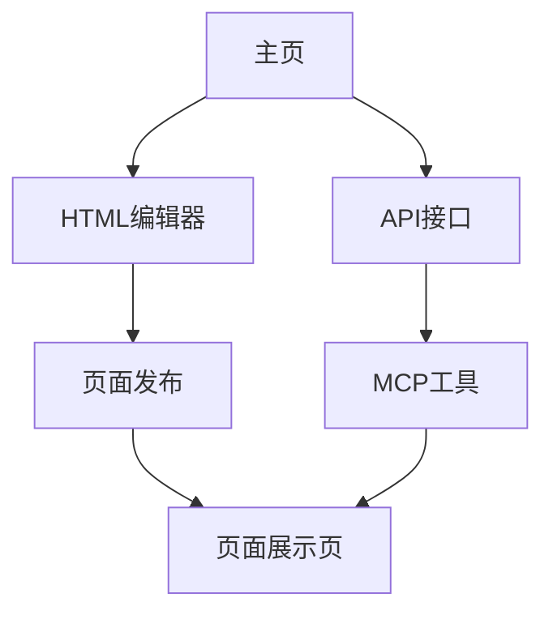

## 1. Product Overview

一个运行在Cloudflare Worker上的页面发布工具，允许用户创建、更新、删除和获取HTML页面，并提供页面截图功能。
- 解决用户快速发布和管理HTML页面的需求，支持页面内容的CRUD操作和可视化预览。
- 目标是为开发者和内容创作者提供一个简单易用的页面发布平台。

## 2. Core Features

### 2.1 User Roles
不需要用户角色区分，所有用户都可以使用全部功能。

### 2.2 Feature Module
我们的页面发布工具包含以下主要页面：
1. **主页**: HTML编辑器界面，页面发布功能
2. **页面展示页**: 显示已发布的HTML页面内容
3. **API接口**: 页面CRUD操作，图片生成功能

### 2.3 Page Details

| Page Name | Module Name | Feature description |
|-----------|-------------|---------------------|
| 主页 | HTML编辑器 | 提供富文本编辑界面，支持HTML代码编辑和实时预览 |
| 主页 | 页面发布 | 接收用户输入的标题和HTML内容，生成唯一页面ID并存储到KV |
| 页面展示页 | 内容渲染 | 根据页面ID从KV获取HTML内容并渲染显示 |
| API接口 | 页面创建 | 验证HTML格式，生成拼音+随机字符串作为key，存储到Cloudflare KV |
| API接口 | 页面获取 | 根据页面ID从KV获取HTML内容，返回标准格式响应 |
| API接口 | 页面更新 | 验证页面存在性和HTML格式，更新KV中的页面内容 |
| API接口 | 页面删除 | 验证页面存在性，从KV中删除指定页面 |
| API接口 | 页面截图 | 使用Puppeteer将HTML页面转换为PNG图片，返回base64编码 |
| MCP工具 | 页面发布工具 | 通过MCP协议提供页面创建功能 |
| MCP工具 | 获取页面图片 | 通过MCP协议提供页面截图功能 |
| MCP工具 | 页面更新工具 | 通过MCP协议提供页面更新功能 |
| MCP工具 | 页面删除工具 | 通过MCP协议提供页面删除功能 |
| MCP工具 | 获取页面代码 | 通过MCP协议提供页面内容获取功能 |

## 3. Core Process

用户访问主页 → 编辑HTML内容 → 发布页面 → 获得页面URL → 访问页面或获取截图

管理员通过MCP工具 → 创建/更新/删除页面 → 获取页面截图或代码

## 4. User Interface Design

### 4.1 Design Style
- 主色调：现代简洁风格，以蓝色和白色为主
- 按钮样式：圆角按钮，hover效果
- 字体：系统默认字体，14px-16px为主要字号
- 布局风格：响应式布局，卡片式设计
- 图标风格：简洁的线性图标

### 4.2 Page Design Overview

| Page Name | Module Name | UI Elements |
|-----------|-------------|-------------|
| 主页 | HTML编辑器 | 文本编辑区域，工具栏，实时预览窗口 |
| 主页 | 页面发布 | 标题输入框，发布按钮，成功提示 |
| 页面展示页 | 内容渲染 | 全屏HTML内容展示区域 |

### 4.3 Responsiveness
桌面优先设计，支持移动端自适应，考虑触摸交互优化。